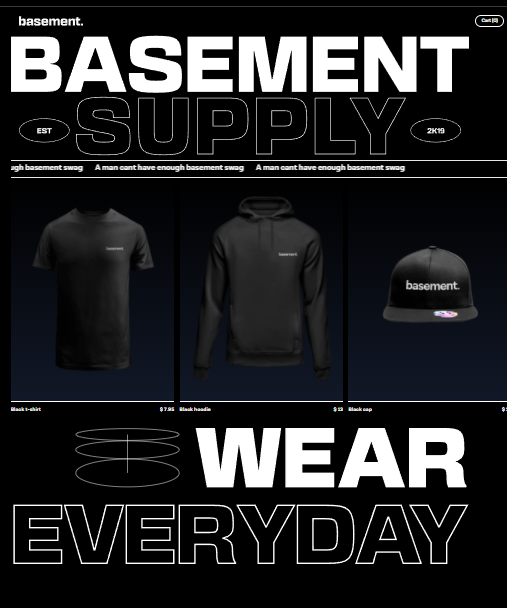
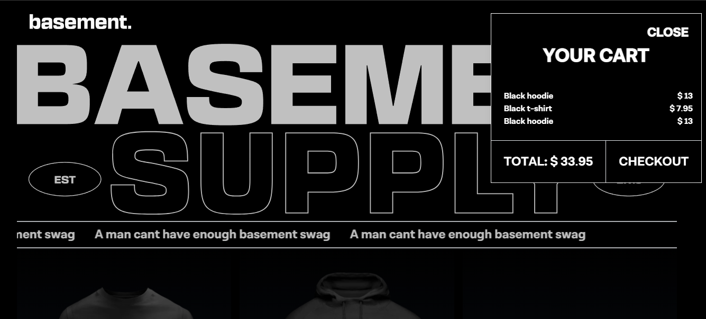

# basement.studio challenge: b. Supply


## Pagina principal



## Modal con la carta de productos



## Corriendo el proyecto
```bash
# Instalar dependencias del proyecto
npm install

# Correr el servidor de desarrollo
npm run dev
```

## Modalidad de entrega
* Repositorio público subido a GitHub, Gitlab, Bitbucket.
